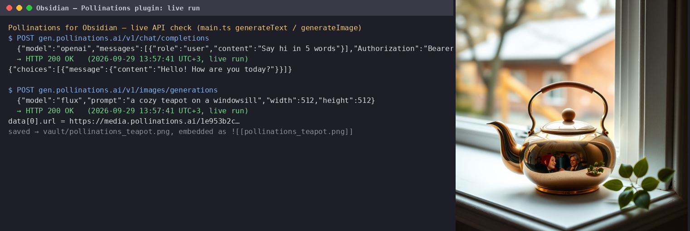

# Pollinations for Obsidian

Generate text and images inside your Obsidian notes with your own
[Pollinations](https://pollinations.ai) account — you pay with your own
Pollen (BYOP).

## Features

- **Generate text at cursor** — describe what you need; if you have a
  selection, the plugin sends it as context (rewrite/expand) and replaces
  it with the result.
- **Generate image and embed** — describe the image; it is generated via
  your Pollinations account, saved into your vault and embedded at the
  cursor with `![[…]]`.
- Any text model from <https://gen.pollinations.ai/text/models> and any
  image model from <https://gen.pollinations.ai/image/models> — set them
  in the settings tab (defaults: `openai`, `flux`).
- Configurable image size and vault folder for images.

## Install

1. Download `manifest.json`, `main.js` and `styles.css` from the latest
   [release](https://github.com/SvirepyiBambr/pollinations-obsidian/releases).
2. Put them into `<vault>/.obsidian/plugins/pollinations/`.
3. Enable "Pollinations" in Settings → Community plugins.
4. Open the plugin settings and paste your API key from
   <https://enter.pollinations.ai/keys>.

## Usage

1. Open a note and put the cursor (or select text to rewrite).
2. Run the command palette (Ctrl/Cmd+P):
   - **Pollinations: Generate text at cursor**
   - **Pollinations: Generate image and embed**
3. Describe what you want → Generate. Ctrl+Enter also submits.

## Demo

1. *Generate text at cursor* with the prompt
   "Write a two-sentence haiku-style description of autumn rain":

   > Wet leaves surrender in slow spirals —  
   > the rain rewrites the street in ink.

2. *Generate image and embed* with the prompt
   "autumn rain over a quiet street, watercolor style" produces a PNG in
   the vault folder `pollinations/`, embedded as
   `![[pollinations/…png]]`.

## Privacy

Prompts and selections are sent to `gen.pollinations.ai` with your API
key to generate the result — nothing else is stored or sent anywhere.

## Development

```bash
npm install        # with your own toolchain
npm run build      # esbuild bundle -> main.js
```

The bundle is built with esbuild (`esbuild.config.mjs`), TypeScript
strict mode, Obsidian API only — no runtime dependencies.

## License

MIT

## Live demo



Real run (2026-09-29): `POST /v1/chat/completions` and `POST /v1/images/generations` against `gen.pollinations.ai` with the plugin's exact request shape — text reply and the generated image are shown above (`demo/teapot-result.png` is the actual API result).
